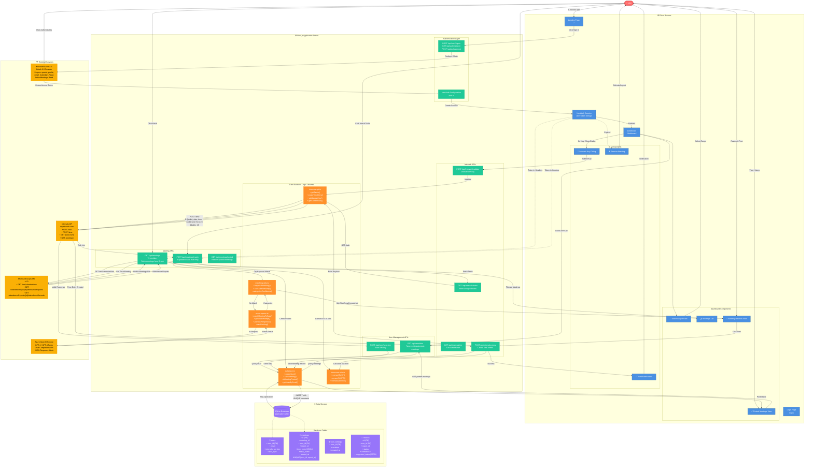

# Manual Workflow - Complete Architecture Diagram

```mermaid
flowchart TB
    User([👤 User])

    subgraph Browser["🌐 Client Browser"]
        LandingPage["Landing Page<br/>/"]
        LoginPage["Login Page<br/>/login"]
        Dashboard["Dashboard<br/>/dashboard"]

        subgraph DashboardComponents["Dashboard Components"]
            DatePicker["📅 Date Range Picker"]
            MeetingsList["📋 Meetings List"]
            MatchesView["🎯 Meeting Matches View"]
            PostedView["✅ Posted Meetings View"]
        end

        subgraph UIComponents["UI Components"]
            KeyDialog["🔑 Intervals Key Dialog"]
            SessionWarning["⚠️ Session Warning"]
            ToastNotif["🔔 Toast Notifications"]
        end

        SessionMgmt["NextAuth Session<br/>JWT Token Storage"]
    end

    subgraph NextJsServer["⚙️ Next.js Application Server"]

        subgraph AuthLayer["Authentication Layer"]
            AuthRoute["POST /api/auth/signin<br/>GET /api/auth/session<br/>POST /api/auth/signout"]
            NextAuthConfig["NextAuth Configuration<br/>auth.ts"]
        end

        subgraph MeetingAPIs["Meeting APIs"]
            GetMeetings["GET /api/meetings<br/>?from=&to=<br/>Fetch meetings from Graph"]
            MatchMeetings["POST /api/meetings/match<br/>AI-powered task matching"]
            PostedMeetings["GET /api/meetings/posted<br/>Retrieve posted meetings"]
        end

        subgraph IntervalsAPIs["Intervals APIs"]
            GetTasks["GET /api/intervals/tasks<br/>Fetch assigned tasks"]
            ValidateKey["POST /api/intervals/validate<br/>Validate API key"]
            GetMe["GET /api/intervals/me<br/>Get current user"]
            ProxyAPI["POST /api/intervals-proxy<br/>Create time entries"]
        end

        subgraph UserAPIs["User Management APIs"]
            GetUserData["GET /api/user/data<br/>?type=settings|posted-meetings"]
            SaveKey["POST /api/user/save-key<br/>Store API key"]
        end

        subgraph CoreLibraries["Core Business Logic Libraries"]
            DatabaseLib["database.ts<br/>• createUser()<br/>• saveMeeting()<br/>• isMeetingPosted()<br/>• getUserByEmail()"]

            IntervalsLib["intervals-api.ts<br/>• getTasks()<br/>• createTimeEntry()<br/>• validateApiKey()<br/>• getCurrentUser()"]

            OpenAILib["azure-openai.ts<br/>• matchMeetingToTask()<br/>• generatePrompt()<br/>• parseAIResponse()<br/>• rateLimiting()"]

            MatchingLib["matching-utils.ts<br/>• keywordMatching()<br/>• calculateSimilarity()<br/>• categorizeConfidence()"]

            TimezoneLib["timezone-utils.ts<br/>• convertToIST()<br/>• convertToUTC()<br/>• formatDateTime()"]
        end
    end

    subgraph ExternalServices["☁️ External Services"]
        AzureAD["Microsoft Azure AD<br/>OAuth 2.0 Provider<br/>Scopes: openid, profile,<br/>email, Calendars.Read,<br/>OnlineMeetings.Read"]

        GraphAPI["Microsoft Graph API<br/>v1.0<br/>• GET /me/calendarView<br/>• GET /onlineMeetings/{id}/attendanceReports<br/>• GET /attendanceReports/{id}/attendanceRecords"]

        IntervalsAPI["Intervals API<br/>myintervals.com<br/>• GET /task<br/>• POST /time<br/>• GET /person/me<br/>• GET /worktype"]

        AzureOpenAI["Azure OpenAI Service<br/>GPT-4 / GPT-4 Turbo<br/>Chat Completions API<br/>JSON Response Mode"]
    end

    subgraph DataStorage["💾 Data Storage"]
        SQLite[("SQLite Database<br/>application.sqlite")]

        subgraph Tables["Database Tables"]
            UsersTable["👥 users<br/>• user_id (PK)<br/>• email<br/>• intervals_api_key<br/>• last_sync"]

            MeetingsTable["📅 meetings<br/>• id (PK)<br/>• meeting_id<br/>• user_id (FK)<br/>• report_id<br/>• time_entry (JSON)<br/>• task_name<br/>• posted_at<br/>UNIQUE(user_id, report_id)"]

            SettingsTable["⚙️ user_settings<br/>• user_id (FK)<br/>• enabled<br/>• created_at"]

            ReviewsTable["📝 reviews<br/>• id (PK)<br/>• user_id (FK)<br/>• report_id<br/>• status<br/>• confidence<br/>• suggested_tasks (JSON)"]
        end
    end

    %% User Flow
    User -->|"1. Access App"| LandingPage
    LandingPage -->|"Click Sign In"| AuthRoute

    %% Authentication Flow
    AuthRoute -->|"Redirect OAuth"| AzureAD
    AzureAD -->|"User Authenticates"| User
    AzureAD -->|"Return Access Token"| NextAuthConfig
    NextAuthConfig -->|"Create Session"| SessionMgmt
    SessionMgmt -->|"Redirect"| Dashboard

    %% API Key Setup
    Dashboard -->|"Check API Key"| GetUserData
    GetUserData -->|"Query User"| DatabaseLib
    DatabaseLib <-->|"SQL Operations"| SQLite
    SQLite -.-> UsersTable

    Dashboard -->|"No Key: Show Dialog"| KeyDialog
    KeyDialog -->|"Submit Key"| ValidateKey
    ValidateKey -->|"Validate"| IntervalsLib
    IntervalsLib -->|"GET /person/me"| IntervalsAPI
    IntervalsAPI -->|"Valid Response"| SaveKey
    SaveKey -->|"Store Key"| DatabaseLib

    %% Fetch Meetings Flow
    Dashboard --> DatePicker
    DatePicker -->|"Select Range"| User
    User -->|"Click Fetch"| GetMeetings
    GetMeetings -->|"Convert IST to UTC"| TimezoneLib
    GetMeetings -->|"GET /me/calendarView"| GraphAPI
    GraphAPI -->|"Online Meetings List"| GetMeetings
    GetMeetings -->|"For Each Meeting"| GraphAPI
    GraphAPI -->|"Attendance Reports"| GetMeetings
    GetMeetings -->|"Check Posted"| DatabaseLib
    SQLite -.-> MeetingsTable
    GetMeetings -->|"Filtered Meetings"| MeetingsList

    %% Task Matching Flow
    User -->|"Click Match Tasks"| MatchMeetings
    MatchMeetings -->|"Fetch Tasks"| GetTasks
    GetTasks -->|"GET /task"| IntervalsLib
    IntervalsLib -->|"API Request"| IntervalsAPI
    IntervalsAPI -->|"Task List"| MatchMeetings

    MatchMeetings -->|"Try Keyword Match"| MatchingLib
    MatchingLib -->|"No Match"| OpenAILib
    OpenAILib -->|"AI Request"| AzureOpenAI
    AzureOpenAI -->|"Match Result"| OpenAILib
    OpenAILib -->|"Categorize"| MatchingLib
    MatchingLib -->|"High/Med/Low/Unmatched"| MatchesView

    %% Post Time Entry Flow
    User -->|"Review & Post"| MatchesView
    MatchesView -->|"Click Post"| ProxyAPI
    ProxyAPI -->|"Calculate Duration"| TimezoneLib
    ProxyAPI -->|"Build Payload"| IntervalsLib
    IntervalsLib -->|"POST /time<br/>{taskid, date, time,<br/>worktypeid: 813419,<br/>billable: t/f}"| IntervalsAPI
    IntervalsAPI -->|"Time Entry Created"| ProxyAPI
    ProxyAPI -->|"Save Meeting Record"| DatabaseLib
    DatabaseLib -->|"INSERT with<br/>UNIQUE constraint"| SQLite
    ProxyAPI -->|"Success"| ToastNotif
    ToastNotif -->|"Notification"| User

    %% View Posted Meetings
    User -->|"View History"| PostedView
    PostedView -->|"GET posted-meetings"| GetUserData
    GetUserData -->|"Query Meetings"| DatabaseLib
    DatabaseLib -->|"Posted List"| PostedView

    %% Session Management
    SessionMgmt -.->|"Token in Headers"| GetMeetings
    SessionMgmt -.->|"Token in Headers"| MatchMeetings
    SessionMgmt -.->|"Expired"| SessionWarning
    SessionWarning -->|"Refresh/Logout"| User

    %% Styling
    classDef userClass fill:#FF6B6B,stroke:#C92A2A,color:#fff
    classDef browserClass fill:#4A90E2,stroke:#2E5C8A,color:#fff
    classDef serverClass fill:#51CF66,stroke:#2F9E44,color:#fff
    classDef externalClass fill:#FAB005,stroke:#F08C00,color:#000
    classDef storageClass fill:#9775FA,stroke:#7048E8,color:#fff
    classDef apiClass fill:#20C997,stroke:#12B886,color:#fff
    classDef libClass fill:#FF922B,stroke:#FD7E14,color:#fff

    class User userClass
    class LandingPage,LoginPage,Dashboard,DatePicker,MeetingsList,MatchesView,PostedView,KeyDialog,SessionWarning,ToastNotif,SessionMgmt browserClass
    class AuthRoute,NextAuthConfig,GetMeetings,MatchMeetings,PostedMeetings,GetTasks,ValidateKey,GetMe,ProxyAPI,GetUserData,SaveKey apiClass
    class DatabaseLib,IntervalsLib,OpenAILib,MatchingLib,TimezoneLib libClass
    class AzureAD,GraphAPI,IntervalsAPI,AzureOpenAI externalClass
    class SQLite,UsersTable,MeetingsTable,SettingsTable,ReviewsTable storageClass
```
